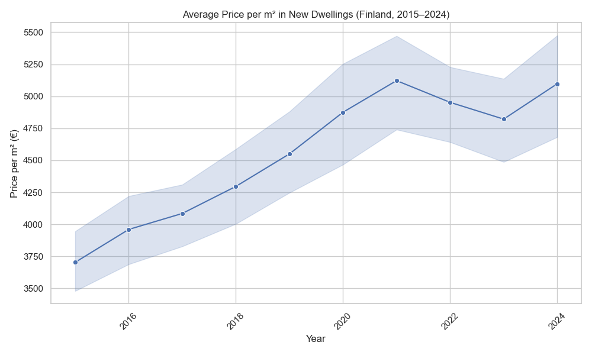
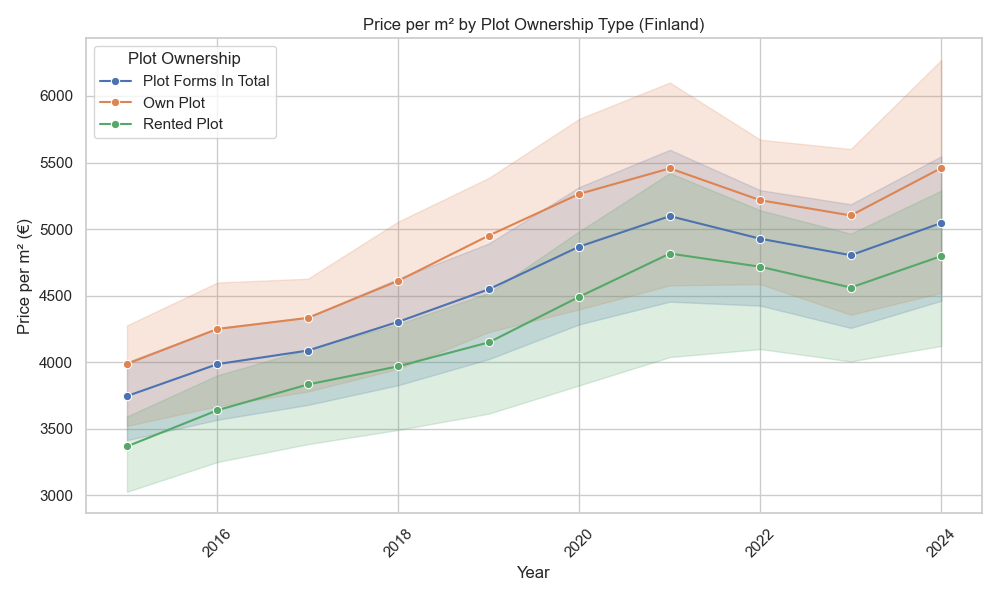
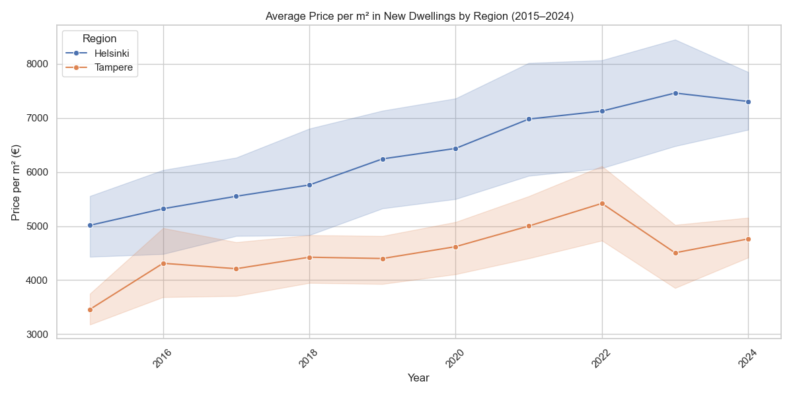

# 🏠 Finland Housing Market Analysis (2015–2024)

This project presents a data analysis of the Finnish housing market using official statistics from Statistics Finland's open API.  
The primary focus is on price trends of new dwellings measured in euros per square meter (EUR/m²) from 2015 to 2024.

---

## 🔧 How to Run the Project

### 1. Clone the repository

```bash
git clone https://github.com/jankry1/finland-housing-analysis.git
cd finland-housing-analysis
```

### 2. Create and activate a virtual environment
```bash
python3 -m venv venv
source venv/bin/activate
```

### 3. Install dependencies
```bash
pip install -r requirements.txt
```

### 4. Fetch the latest data from Statistics Finland
```bash
python src/get_data.py
```
### 5. Run the analysis and generate visualizations
```bash
python src/analyze_data.py
```

## 📊 Key Insights
📈 Housing prices in Finland have steadily increased from 2015 to 2024, especially after 2020.


🏡 Land ownership affects price trends — dwellings on rented plots show different patterns compared to owned plots.


📍 Regional comparison: Helsinki's housing prices remain significantly higher than those in other major cities like Tampere.


## 🛠️ Tools and Technologies
Python 3.10+

pandas, matplotlib, seaborn for data analysis and visualization

pyjstat, requests for querying the Statistics Finland API

## 🤝 Acknowledgements
## 📊 Data source: [Statistics Finland Open Data API](https://pxdata.stat.fi/PxWeb/pxweb/en/StatFin/StatFin__ashi/statfin_ashi_pxt_12de.px/)
